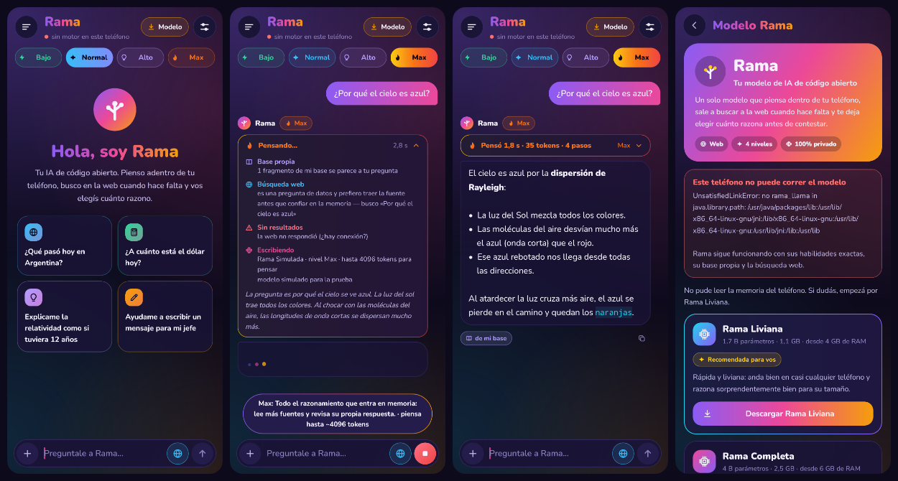

# Rama AI 4.0

IA de código abierto que corre entera en el teléfono (Android 8+, arm64): piensa
adentro del dispositivo, busca en la web cuando hace falta y te deja elegir cuánto
razona antes de contestar.

**APK listo para instalar:** [`dist/RamaAI-4.0.0.apk`](dist/RamaAI-4.0.0.apk)



## Novedades respecto de la 3.2

| | 3.2 | 4.0 |
|---|---|---|
| Modelos | 13 de terceros (Qwen, Gemma, Llama, Phi) | **Uno solo: Rama**, en tres tamaños |
| Pensamiento | encendido/apagado (sólo mostrar pasos) | **Bajo · Normal · Alto · Max**, con presupuesto real de razonamiento |
| Búsqueda web | DuckDuckGo (sólo resúmenes) | DuckDuckGo → Bing → Mojeek, Wikipedia, Google Noticias, dólar (DolarApi), clima (Open‑Meteo) y **lectura de las páginas** |
| Interfaz | oscura, verde, Roboto | **colorida** (degradés violeta‑fucsia‑naranja, aurora de fondo), tipografía **Nunito** |
| Ícono | rama verde sobre negro | rama con hojas y destello de IA sobre degradé (adaptativo + monocromo) |

### El modelo Rama

Rama es un solo modelo con su propia identidad, herramientas y niveles de
pensamiento, construido sobre los **pesos abiertos de Qwen3** (licencia Apache 2.0),
que razonan dentro de `<think>` y permiten apagar ese razonamiento. Se ofrece en
tres tamaños y la app recomienda **el más potente que entra en la RAM** del teléfono:

| Edición | Parámetros | Descarga | Recomendada desde |
|---|---|---|---|
| Rama Liviana | 1.7 B | ~1,1 GB | 4 GB de RAM |
| Rama Completa | 4 B | ~2,5 GB | 6 GB de RAM |
| **Rama Ultra** | **8 B** | ~5,0 GB | 12 GB de RAM |

El contexto se ajusta a la memoria (hasta 16 384 tokens en teléfonos de 16 GB).
Entrenar un modelo desde cero no es posible acá; lo "propio" de Rama es todo lo que
rodea a esos pesos: identidad, búsqueda, habilidades exactas, base de conocimiento y
el control del razonamiento. Si le preguntás en qué se basa, lo dice.

### Niveles de pensamiento

| Nivel | Razonamiento | Búsqueda web |
|---|---|---|
| ⚡ Bajo | ninguno: responde al toque | 4 resultados |
| ✦ Normal | hasta 400 tokens | 5 resultados + 1 página leída |
| 💡 Alto | hasta 1 200 tokens | 6 resultados + 2 páginas + Wikipedia |
| 🔥 Max | hasta 4 096 tokens (lo que entre en memoria) y verifica sus datos | 8 resultados + 3 páginas + Wikipedia |

Si el modelo agota el presupuesto, la app cierra el bloque `<think>` y le pide la
respuesta; el motor reutiliza lo ya procesado, así que el corte no cuesta tiempo extra.
El razonamiento se ve en vivo en una tarjeta del color del nivel.

## Instalar

1. **Desinstalá la 3.2** (el APK está firmado con otra clave y Android no deja
   actualizar encima). Los chats y modelos viejos se borran con ella.
2. Instalá `dist/RamaAI-4.0.0.apk`.
3. Tocá **Modelo** y bajá la edición recomendada (la descarga sigue en segundo plano).

## Compilar

```sh
./compilar.sh          # pruebas del motor + APK firmado en dist/
./prueba/interfaz.sh   # prueba de la interfaz con Robolectric y capturas en build/capturas/
```

No usa Gradle ni el SDK de Android: `compilar.sh` baja a `.herramientas/` apktool,
Kotlin 2.0.21, D8, `android.jar` 34, dex2jar y uber-apk-signer. Parte de
`base/rama32-original.apk`, que aporta el motor nativo (llama.cpp), la librería de
Kotlin y las clases que se reutilizan (habilidades, base de conocimiento, memoria,
chats, adjuntos); saca las clases que la 4.0 reemplaza (`app/clases-quitadas.txt`),
compila `app/src` a un dex nuevo, reemplaza recursos, assets y manifiesto, y firma.

## Estructura

```
app/src/ar/rama/ai/          interfaz: MainActivity, pantallas, tema, íconos, Markdown
app/src/ar/rama/ai/motor/    Asistente, MotorRama, Catalogo, NivelPensar, Buscador…
app/res, app/assets          ícono adaptativo, tema, Nunito, base de conocimiento
prueba/PruebasMotor.kt       47 pruebas del motor (JVM, con un modelo simulado)
prueba/robolectric/          prueba de la interfaz sobre el APK compilado
```

## Créditos

Pesos del modelo: Qwen3 (Alibaba, Apache 2.0) · Motor: llama.cpp (MIT) ·
Tipografía: Nunito (SIL OFL, incluida en `app/assets/fuentes/OFL.txt`).
